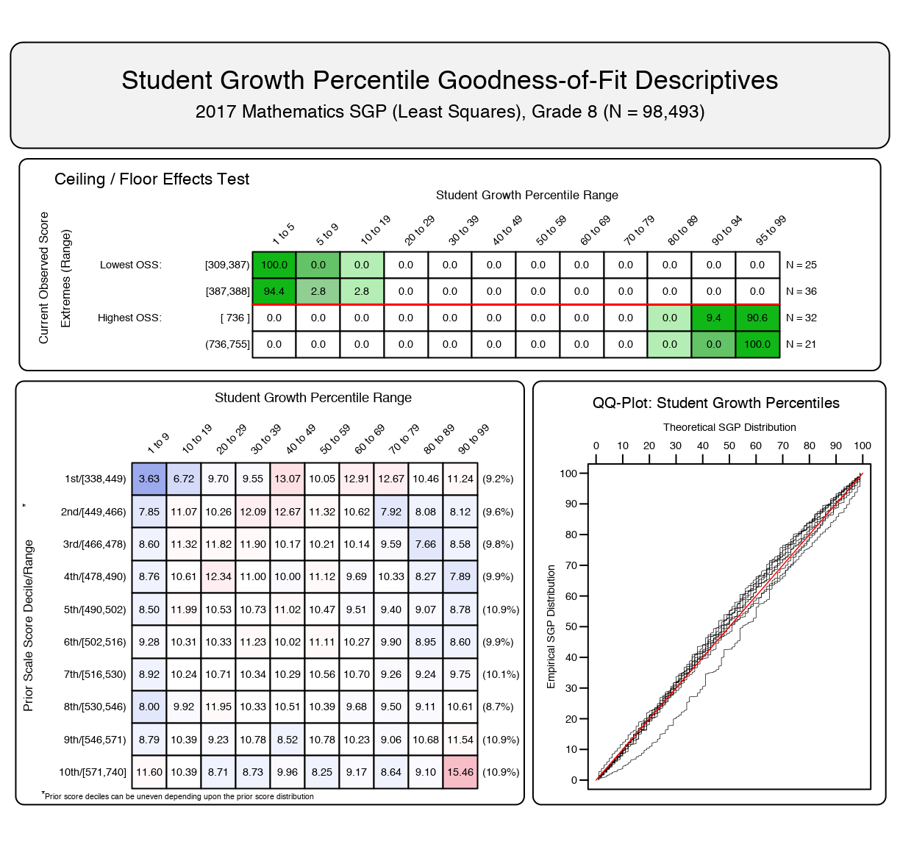
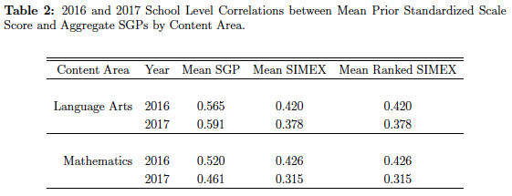
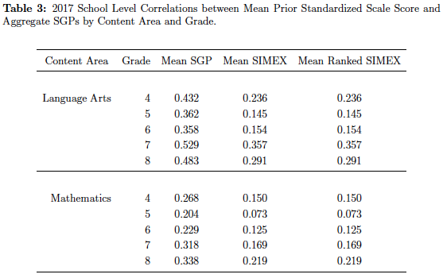

###    Ranked SIMEX Measurement Error Correction
####               &
###    Student Growth Percentiles
####   ______________________
####   *Adam Van Iwaarden*
####   *Damian Betebenner*
####   *Center for Assessment (NCIEA)*
#####  https://gitpitch.com/adamvi/NCME_Ranked_SIMEX_SGP

---
### Presentation Roadmap

What will be covered:
- Review the measurement error problem |
- Basics of the SIMEX Method |
- SIMEX use in Student Growth Percentiles (SGP) |
- Provide evidence of effectiveness from an example state's analyses |

---
### Presentation Roadmap

NOT covered here (but available in the report):
- Details on SIMEX and Ranked SIMEX implementation SGP calculation |
  + Found in the full report (available online) |

---

###  Additional Resources
- *Presentation* - https://gitpitch.com/adamvi/NCME_Ranked_SIMEX_SGP
- *Full SIMEX Report*
  + [Online](https://adamvi.github.io/NCME_Ranked_SIMEX_SGP/)
  + [PDF Download](https://github.com/adamvi/NCME_Ranked_SIMEX_SGP/raw/master/PDF/Ranked_SIMEX_SGP.pdf)
- *Code Examples*
  + [SIMEX with Toy Data Set](https://gist.github.com/adamvi/26b931b26ece4fdd482dba7bde69a945)
  + [SIMEX with Simulated Data Set](https://gist.github.com/adamvi/0515b1694e7b108139228331a80e7f9e)
  + [SIMEX Monte Carlo](https://gist.github.com/adamvi/5169922)
- [*General SGP Resources*](https://github.com/CenterForAssessment/SGP_Resources)

---

###  Measurement error (ME)

-  Inherent component of all standardized tests |
-  Additional uncertainty in growth estimates (e.g. SGPs) |
-  Produces biased estimates |
  + disadvantages students with lower prior achievement and vice versa |
  + transferred to aggregate measures of growth when concentrated low/high prior achievement students |
---

###  SIMEX Method of ME Correction

- Simulation/Extrapolation (SIMEX) techniques reduces bias in SGPs (Shang, VanIwaarden and Betebenner, 2015) |
- This method is available in the SGP package for R |
- Several states use the SIMEX measures in accountability and evaluation policies. |
---

###  SIMEX - the name says it all...

- SIM-ulation & EX-trapolation |
- Estimate the impact of ME through a series of SIMULATION experiments |
  + Increasing amounts of simulated ME added to observed values to create even more error-prone "pseudo" data sets|
- Parameter estimates of interest are calculated using perturbed data|
- Simulations are repeated a large number of times at each level of increased error. |

---
###  SIMEX - the name says it all...

-  EXTRAPOLATE |
  + Average the parameter estimates at each level of error. |
  + Regression model is used to EXTRAPOLATE the predicted value where measurement error = 0 |
    - Voila! The SIMEX estimate of the error-free parameter. |

---
###  SIMEX - what is it good for?

- Does not make strong assumptions about variable distributions |
- Easier to implement for complicated models (e.g. nonparametric quantile regression) |
- Assumption that the SEM is known or can be reasonably well estimated. |

---
###  SIMEX Method and SGPs

- Straightforward when interested in a simple parameter (e.g. regression model coefficient) |
- Not what needs correcting for in SGP models |
- SGPs are derived from the fitted values of the model |
  + predicted test scores at 100 percentiles |
- Create a SIMEX corrected lookup-table of predicted scores to derive SGPs. |

---
###  SIMEX Method and SGPs

Unfortunately ...
- SIMEX corrected SGPs also have technical limitations. |
  - Student level SIMEX SGPs have larger errors than the uncorrected ones |
    + SIMEX SGPs preferred for aggregated results (mean or median SGPs) |
    + Uncorrected preferred for student level reporting |

---
###  Ranked SIMEX SGPs

- Castellano and McCaffrey (2017) proposed ranking SIMEX SGP estimates to address: |
  - excess variance from the SIMEX estimation process |
  - uniform distribution of SGPs |
- Best of both worlds for aggregated and individual SGPs |
- Ranked SIMEX values added to SGP computation in 2017 (version 1.7-0.2) |

---
###  Ranked SIMEX SGPs

Unlike SGP/SIMEX calculation in SGP package Castellano and McCaffrey:
- Used closed-form equations to estimate "SIMEX SGPs" |
  + No simulation/extrapolation, quantile regression, etc. |
  + Rely on assumptions about data and ME structures that don't always hold |
- Produces continuous SIMEX SGP values |
  + Re-ranking integer values from the SGP calculations ... not impressive |

---
###  Ranked SIMEX SGPs

Adaptations to the SGP/SIMEX framework:
- Need continuous values of SIMEX SGPs |
  - Add 10X more percentile value calculations |
    + *At least* 10X longer - not tenable |
  - Calculate midpoints (8) between the SIMEX predicted score estimates |
    + Much faster and similar results

---
###  Ranked SIMEX SGPs - Real World Results

- Don't know if excess variance from SIMEX process is reduced. |
  + Rely on evidence from simulation studies |
- Focus on the distribution of SGPs. |
  + Looking for a uniform distribution - marginal and conditional |
  + Uniformity suggests that all levels of growth are observed/possible |
  + Conditional uniformity means this is true REGARDLESS of prior achievement |

---
####  Ranked SIMEX SGPs - Real World Results

Marginal distributions - 8th Grade Math SGPs

- SIMEX distribution is U-shaped |
- Ranking produces a more uniform distribution |

---
###  Ranked SIMEX SGPs - Real World Results

Goodness of Fit Plots - conditional distributions
- Focus on bottom two panels |
  + Left panel is a 10 x 10 grid |
    + SGP deciles x Prior Score deciles |
  + Right panel is a QQ Plot |
    + Theoretical vs empirical uniform distribution |

(Scroll Down)

+++

@title[Uncorrected]

####  Uncorrected

+++
@title[SIMEX Corrected]

####  SIMEX

+++
@title[Ranked SIMEX]

####  Ranked SIMEX

+++

@title[OLS]

####  Ordinary Least Squares SGPs

---
###  Correlation Tables

- Standard SGPs are uncorrelated with prior test scores |
- A negative correlation is created between Ranked/SIMEX SGPs |
  + Translates to school and teacher aggregations |
  + Indicates reduction of bias |

(Scroll Down)

+++
@title[Student]

####  Student Level

+++
@title[SchoolYear]

####  School Level Aggregations by Year

+++
@title[SchoolGrade]

####  School Level Aggregations by Grade

---
###  Take away from example state

- SIMEX corrections seem to be working as expected |
- Ranking the SIMEX SGPs helps re-establish uniformity |
- Support states using SIMEX SGPs to also adopt SIMEX Ranking |

---
## Questions?

- *Presentation* - https://gitpitch.com/adamvi/NCME_Ranked_SIMEX_SGP
- *Full SIMEX Report*
  + [Online](https://adamvi.github.io/NCME_Ranked_SIMEX_SGP/) "https://adamvi.github.io/NCME_Ranked_SIMEX_SGP/"
  + [PDF Download](https://github.com/adamvi/NCME_Ranked_SIMEX_SGP/raw/master/PDF/Ranked_SIMEX_SGP.pdf)
- *Code Examples*
  + [SIMEX with Toy Data Set](https://gist.github.com/adamvi/26b931b26ece4fdd482dba7bde69a945)
  + [SIMEX with Simulated Data Set](https://gist.github.com/adamvi/0515b1694e7b108139228331a80e7f9e)
  + [SIMEX Monte Carlo](https://gist.github.com/adamvi/5169922)
- [*General SGP Resources*](https://github.com/CenterForAssessment/SGP_Resources)
