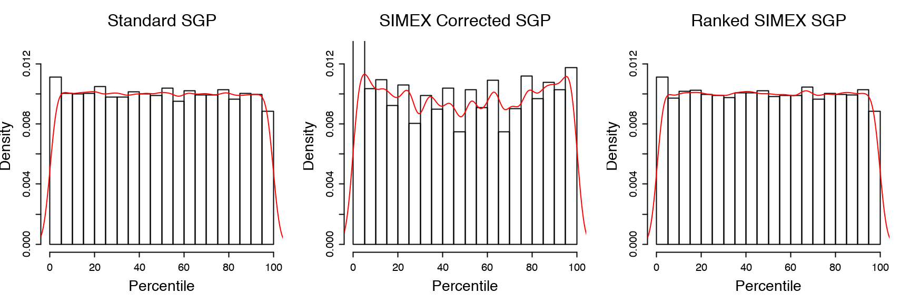
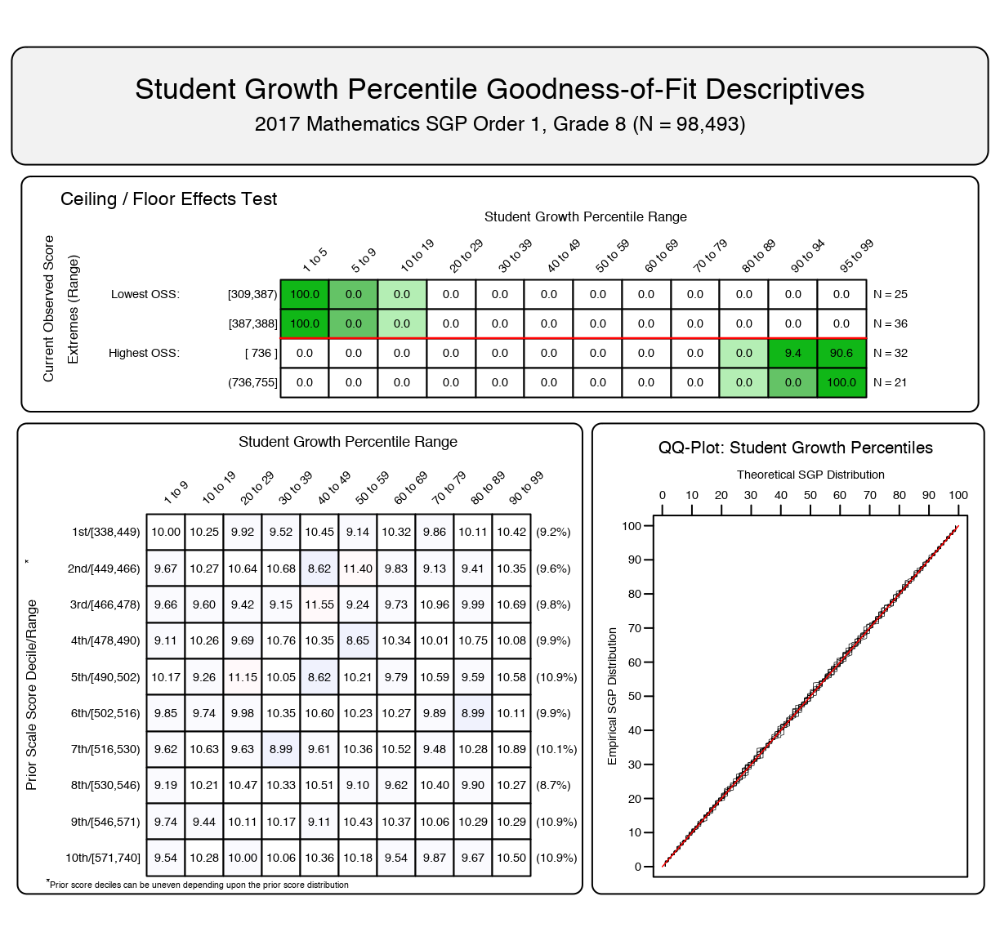
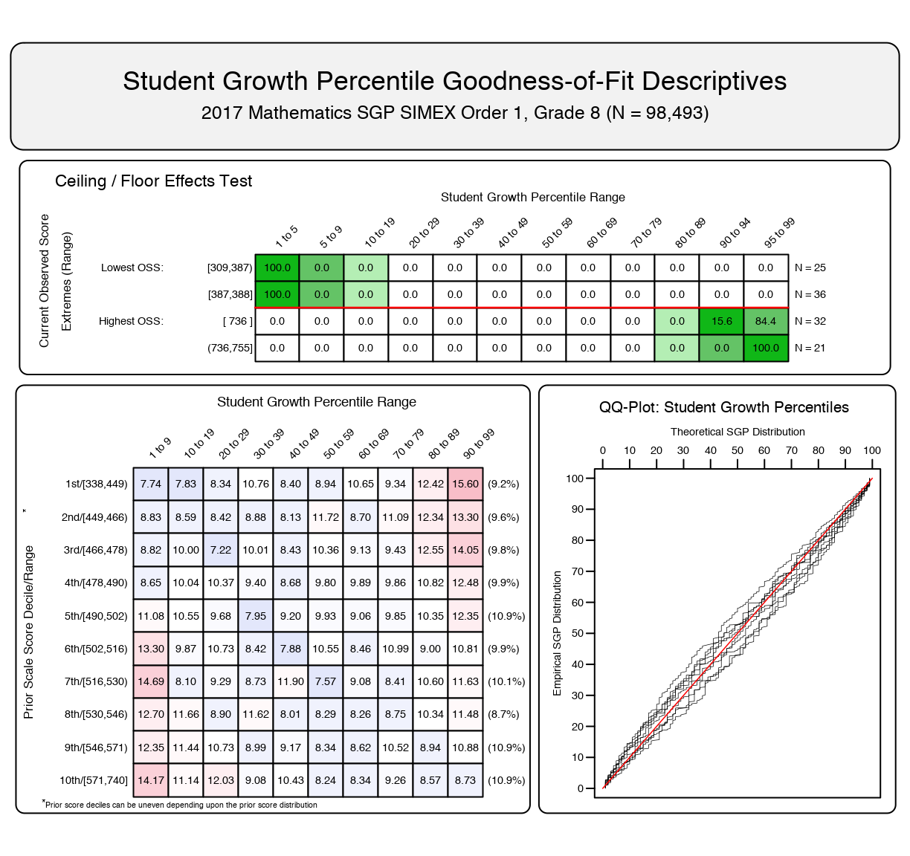
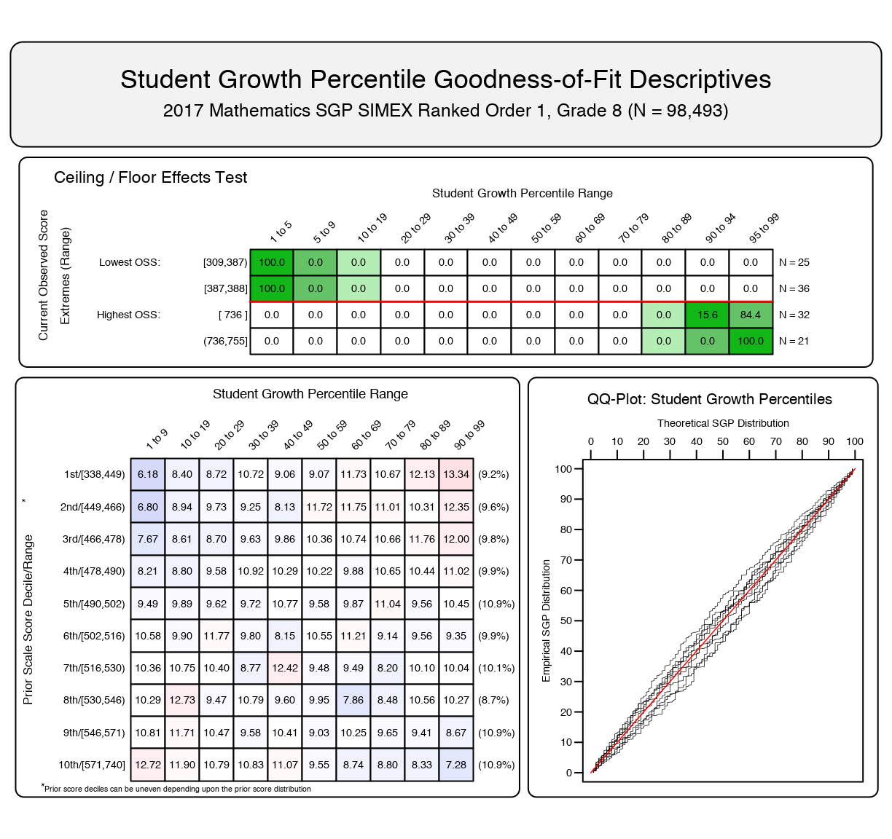
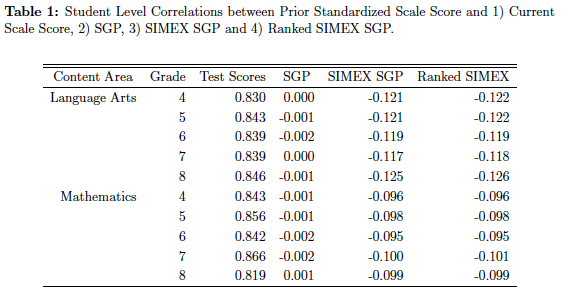

##  SIMEX Measurement Error Correction in Student Growth Percentiles

---

### Presentation Roadmap

- Review the measurement error problem |
- Introduce the SIMEX Method of correcting for ME bias |
- SIMEX implementation in Student Growth Percentiles (SGP) |
- Ranking SIMEX SGPs in the SGP package for R |
- Provide evidence of effectiveness from an example state's analyses |
- Relationship between different SGP estimates with prior student achievement |

---

###  Additional Resources
- [Full SIMEX Report](https://github.com/adamvi/NCME_Ranked_SIMEX_SGP/blob/master/PDF/Ranked_SIMEX_SGP.pdf),
- *Code Examples*
  + [SIMEX with Toy Data Set](https://gist.github.com/adamvi/5169922)
  + [SIMEX with Simulated Data Set](https://gist.github.com/adamvi/5169922)
  + [SIMEX Monte Carlo](https://gist.github.com/adamvi/5169922)
- [General SGP Resources](https://github.com/CenterForAssessment/SGP_Resources)

---

###  Measurement error (ME)

-  Inherent component of all standardized tests |
-  Additional uncertainty in growth estimates (e.g. SGPs) |
-  Produces biased estimates |
  + disadvantages students with lower prior achievement and vice versa |
  + transferred to aggregate measures of educator effectiveness when students with low/high prior achievement are concentrated in a classroom or school |
---

###  SIMEX Method of ME Correction

-  Simulation/Extrapolation (SIMEX) techniques eliminate bias SGPs (Shang, VanIwaarden and Betebenner, 2015) |
-  This method is available in the SGP package for R |
-  Several states use the SIMEX measures in accountability and evaluation policies. |
---

###  SIMEX - the name says it all...

-  SIMulation/EXtrapolation |
-  Estimate the impact of ME through a series of SIMULATION experiments |
  + Increasing amounts of simulated ME are added to observed values to create error-prone "pseudo" data sets
    - A set of increasing small numbers.  Typically ${\lambda}$ = 0.5, 1, 1.5, 2
---
###  SIMEX - the name says it all...

- Parameter estimates of interest are calculated using perturbed data|
- Simulations are repeated a large number of times at each level ${\lambda}$. |

---
###  SIMEX - the name says it all...

-  EXTRAPOLATE |
  + Average the parameter estimates at each level of ${\lambda}$. |
  + Averaged "pseudo" parameter estimates and the "naive" estimates are regressed on ${\lambda}$ |
  + Using this model, EXTRAPOLATE the predicted value at ${\lambda} = -1$ |
    - Voila! The SIMEX estimate of the error-free parameter. |

---
###  SIMEX - what is it good for?

- Does not make strong assumptions about variable distributions |
- Easier to implement for ME models that are less understood (e.g. nonparametric quantile regression) |
- Assumes the SEM is known or can be reasonably well estimated. |

---
###  SIMEX Method and SGPs

- Straightforward when interested in a model parameter (e.g. regression model coefficient) |
- Not what we want to correct for in the SGP model |
- Estimating ${\widehat{SGP}_ X}$, and these quantities are derived from the fitted values of the model |
  + predicted test scores at 100 percentiles |
- Create a SIMEX corrected lookup-table of predicted scores to derive SGPs. |

---
###  SIMEX Method and SGPs

- Unfortunately ... |
  - SIMEX corrected SGPs also have technical limitations. |

- Student level SIMEX SGPs have larger errors than the uncorrected ones |
  + SIMEX preferred for aggregated SGP results (mean or median SGPs) |
  + Uncorrected preferred for student level reporting |

---
###  Ranked SIMEX SGPs

- Castellano and McCaffrey (2017) proposed ranking SIMEX SGP estimates to address: |
  - excess variance from the SIMEX estimation process |
  - uniform distribution of SGPs |
- Best of both worlds for aggregated and individual SGPs |
- Ranked SIMEX values added to SGP computation in 2017 (version 1.7-0.2) |

---
###  Ranked SIMEX SGPs

Unlike SGP/SIMEX calculation in SGP package Castellano and McCaffrey:
- Used closed-form equations to estimate SIMEX SGPs |
  + No simulation/extrapolation, quantile regression, etc. |
  + Make assumptions about data and ME structures that we don't |
- Produces continuous SIMEX SGP values |
  + Re-ranking integer values from the SGP calculations ... not impressive |

---
###  Ranked SIMEX SGPs

*Adaptations to the SGP/SIMEX framework:*          
- Need continuous values of SIMEX SGPs |
  - Add 10X more percentile values |
    + *At least* 10X longer - not tenable |
  - Calculate arithmetic midpoints (8) between the SIMEX estimates of the predicted scores |
    + Much faster and similar results

---
###  Ranked SIMEX SGPs - Results

Marginal distributions - 8th Grade Math SGPs (single prior score)

---
###  Ranked SIMEX SGPs - Results

Goodness of Fit Plots - conditional distributions

(Scroll Down)

+++

@title[Uncorrected]

####  Uncorrected

+++
@title[SIMEX Corrected]

####  SIMEX

+++
@title[Ranked SIMEX]

####  Ranked SIMEX

---
###  Correlation Tables

(Scroll Down)

+++
@title[Student]

####  Student Level

---
## Questions?
